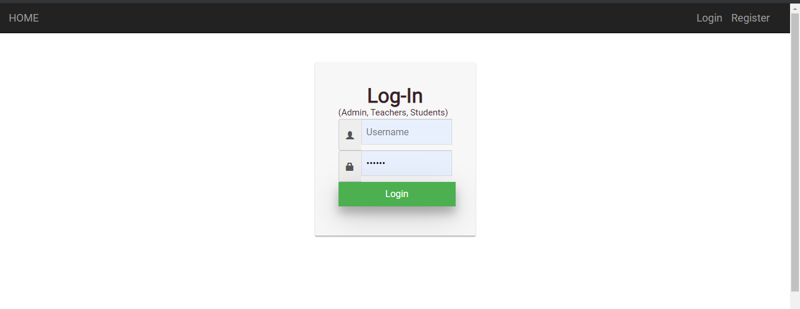
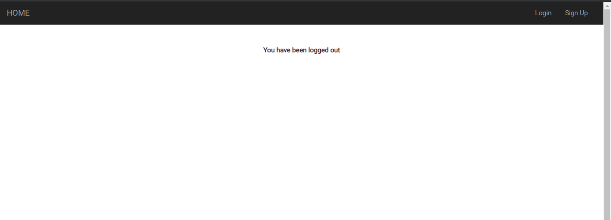
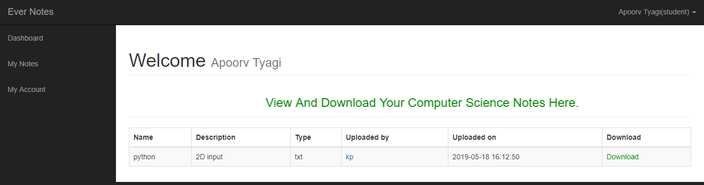
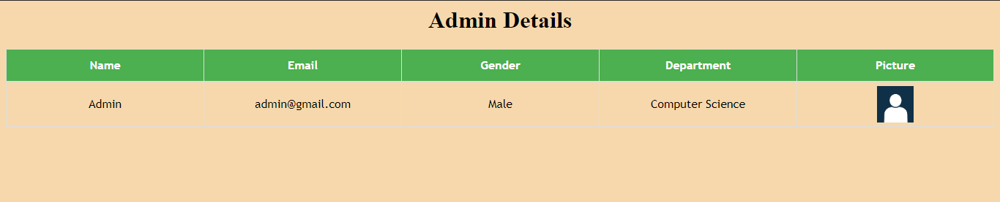
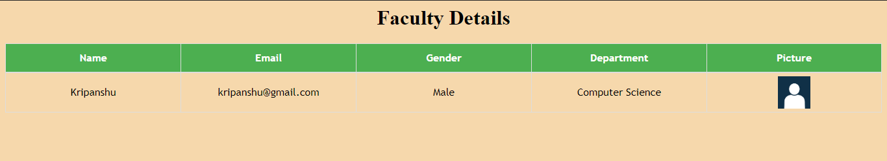
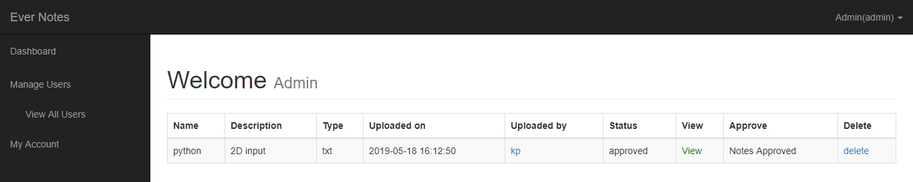
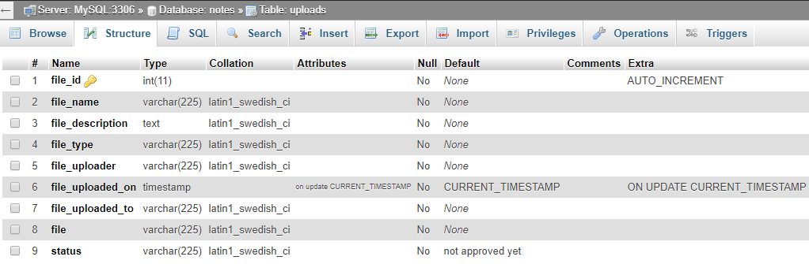
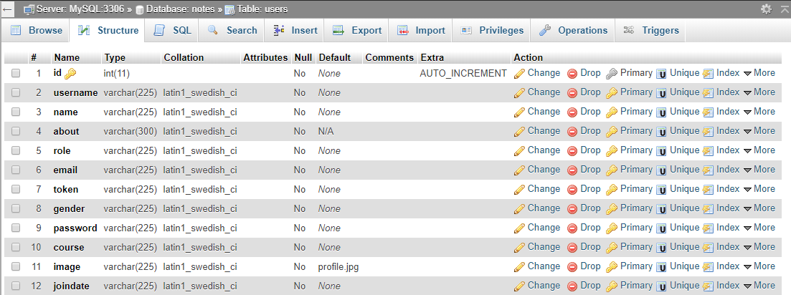

# EverNotes
EverNotes is and online platform for sharing notes among teachers and students. All the users and the notes are managed by the admin of the particular department.

Students can also see the details of their admin as well as their department's teachers.Likewise Teachers can view their admin and their students.

All the uploaded notes will have the details like the name of the person who uploaded,time,type etc.

##Screenshots
    
        
            
                
                    
                        
                            
                                
                                    
                                    
